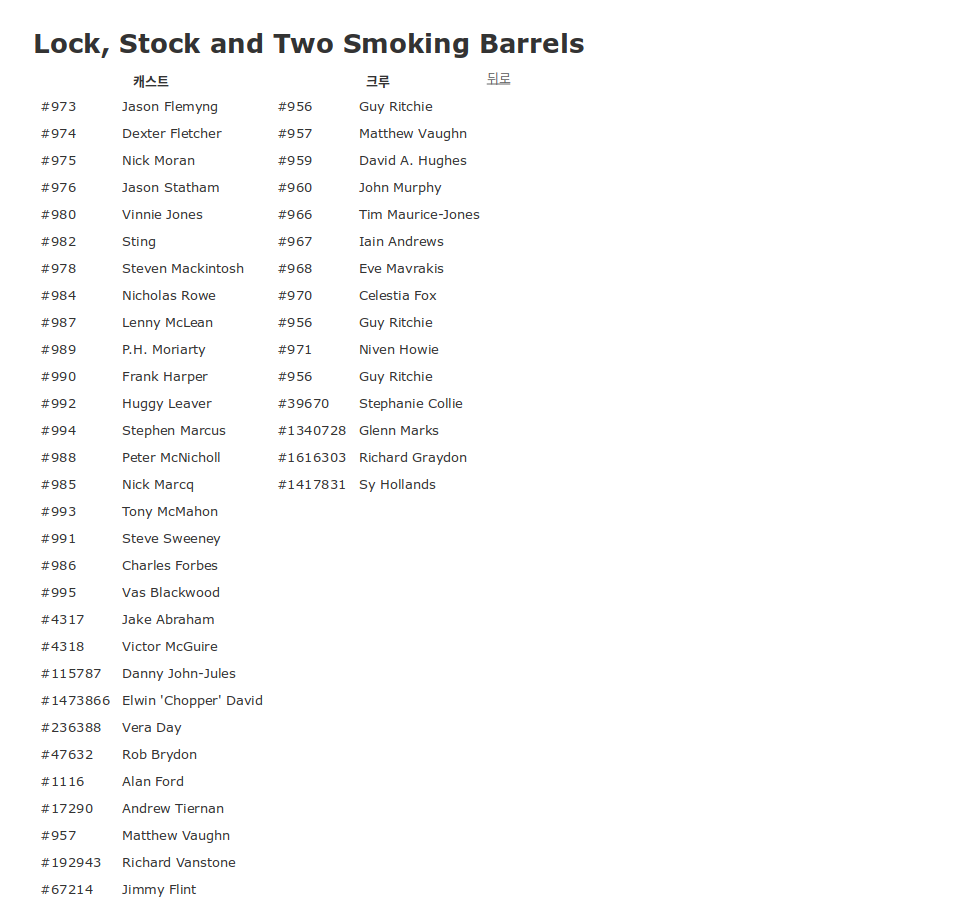
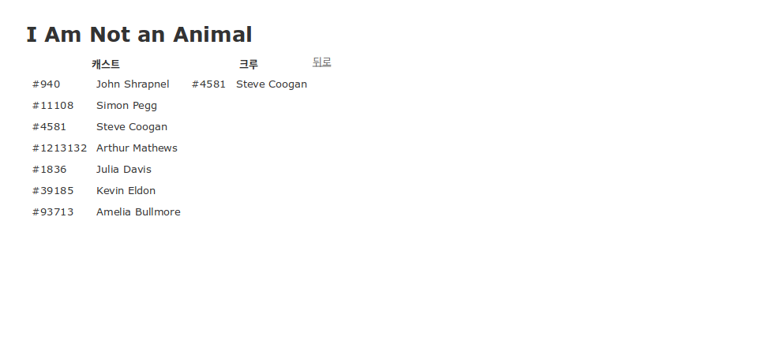

# tmdb-query

[더 무비 데이터베이스(TMDB)][TMDB] API를 이용해 MySQL 데이터베이스에 영화, 텔레비전쇼, 인물 테이블을 구축하는 루비 온 레일즈 어플리케이션.


## 개발 환경

Ubuntu 18.04에서 개발 및 테스트하였다.

- rvm 1.29.9
- Ruby 2.5.3
- Bundler 2.0.1
- Rails 5.2.3
- MySQL 5.6

## 데이터베이스 구조

- 안정적인 개발을 위해 데이터베이스는 tmdb_query_development (개발용), tmdb_query_production (배포용), tmdb_query_test (테스트용)으로 구분하여 이용
- 디폴트로 개발용 서버를 이용
- 데이터베이스는 movie, credit_movie, tv, credit_tv, person의 다섯 테이블로 구성

    

## 환경 구축 절차

Ruby와 MySQL 환경이 구축되지 않은 경우 [해당 문서](docs/environment.md) 참고

## API KEY 설정

`dev/api.key` 파일에 TMDB에서 발급받은 api_key를 저장

## 실행 방법

- MySQL과 Rails 서버가 구동 중인 상황 (구동 방법은 [해당 문서](docs/environment.md#실행) 참고])
- MySQL의 로그인 계정 등 환경 설정은 `config/database.yml`에서 지정
- 테스트 환경에서 실행할 경우, 각 명령 뒤에 `-e test` 옵션을 지정

### 영화 정보 크롤

- 실행 명령

    ```sh
    rails runner lib/crawl_movie.rb <movie_id>
    ```

- 예시

    ```sh
    $ rails runner lib/crawl_movie.rb 150
    Running via Spring preloader in process 29213
    1788 / Nicholas Meyer / people 테이블에 입력 완료
    role: crew, people_id: 1788, movies_id: 154 / credit_movies 테이블에 크레딧 정보 입력 완료
    1790 / Robert Sallin / people 테이블에 입력 완료
    role: crew, people_id: 1790, movies_id: 154 / credit_movies 테이블에 크레딧 정보 입력 완료
    (중략)
    1214565 / John Winston / people 테이블에 입력 완료
    role: cast, people_id: 1214565, movies_id: 154 / credit_movies 테이블에 크레딧 정보 입력 완료
    157612 / Paul Kent / people 테이블에 입력 완료
    role: cast, people_id: 157612, movies_id: 154 / credit_movies 테이블에 크레딧 정보 입력 완료
    154 / Star Trek II: The Wrath of Khan / movies 테이블에 입력 완료
    ```

### TV시리즈 정보 크롤

- 실행 명령

    ```sh
    rails runner lib/crawl_tv.rb <tv_id>
    ```

- 예시

    ```sh
    $ rails runner lib/crawl_tv.rb 150
    Running via Spring preloader in process 29398
    170497 / Norman Lear / people 테이블에 입력 완료
    role: crew, people_id: 170497, tvs_id: 154 / credit_tvs 테이블에 크레딧 정보 입력 완료
    1213872 / Allan Manings / people 테이블에 입력 완료
    role: crew, people_id: 1213872, tvs_id: 154 / credit_tvs 테이블에 크레딧 정보 입력 완료
    (중략)
    1213899 / Ben Powers / people 테이블에 입력 완료
    role: cast, people_id: 1213899, tvs_id: 154 / credit_tvs 테이블에 크레딧 정보 입력 완료
    54421 / Janet Jackson / people 테이블에 입력 완료
    role: cast, people_id: 54421, tvs_id: 154 / credit_tvs 테이블에 크레딧 정보 입력 완료
    154 / Good Times / tvs 테이블에 입력 완료
    ```

## 결과 조회

모든 주소는 Rails 서버에 대한 상대 주소 (디폴트: `http://localhost:3000`)

### 메인 페이지

- 주소: `/`
- 실행 화면
    

### 영화 목록 페이지

- 주소: `/movies`
- 실행 화면
    

### 영화 조회 페이지

- 주소: `/movies/:id`
- 실행 화면
    

### TV시리즈 목록 페이지

- 주소: `/tvs`
- 실행 화면
    

### TV시리즈 조회 페이지

- 주소: `/tvs/:id`
- 실행 화면
    

[TMDB]: https://www.themoviedb.org
