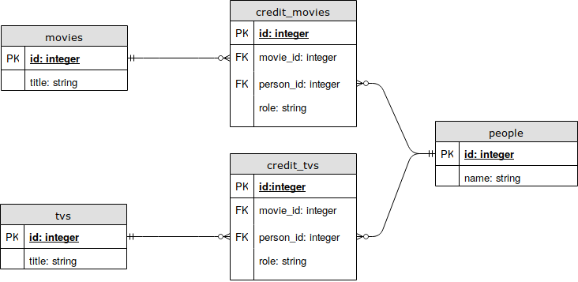

# tmdb-query

__NOTE: This is a project in progress. It does not work at this moment.__

[더 무비 데이터베이스(TMDB)][TMDB] API를 이용해 MySQL 데이터베이스에 영화, 텔레비전쇼, 인물 테이블을 구축하는 루비 온 레일즈 어플리케이션.

## 개발 환경

Ubuntu 18.04에서 개발 및 테스트하였다.

- [RVM][RVM]
- Ruby 2.5.3
- Bundler 2.0.1
- Rails 5.2.3
- MySQL 5.6

## 데이터베이스 구조

데이터베이스는 movie, credit_movie, tv, credit_tv, person의 다섯 테이블로 구성된다.

- 영화 제목 영문명의 최대 길이는 255자를 넘지 않는다고 가정한다. (참고자료 [#1 IMDB의 유저 생성 리스트][long-movie-title-imdb], [#2 TvTropes의 관련 항목][long-movie-title-tvtropes])
- 텔레비전 시리즈 제목 영문명의 최대 길이는 255자를 넘지 않는다고 가정한다. (참고자료 [#1 TvTropes의 관련 항목][long-tv-title-tvtropes], [#2 Digital Spy 포럼의 질문글][long-tv-title-digitalspy])

[RVM]: https://rvm.io
[TMDB]: https://www.themoviedb.org
[long-movie-title-imdb]: https://www.imdb.com/list/ls064443882/
[long-movie-title-tvtropes]: https://tvtropes.org/pmwiki/pmwiki.php/LongTitle/Film
[long-tv-title-tvtropes]: https://tvtropes.org/pmwiki/pmwiki.php/Main/LongTitle
[long-tv-title-digitalspy]: https://forums.digitalspy.com/discussion/2176058/tv-show-movie-with-the-longest-name
